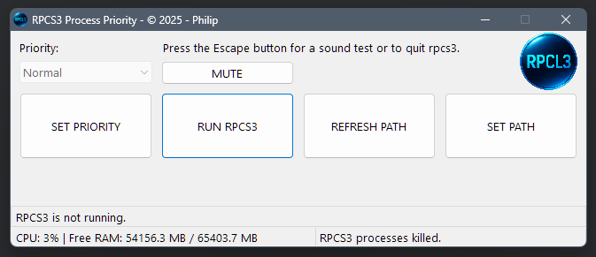

# rpcl3-process-control

**Manage your RPCS3 process priority in Windows.**               

- Below Normal
- Normal
- Above Normal
- High
- Realtime

- Pressing the Escape button will kill all rpcs3.exe processes.

